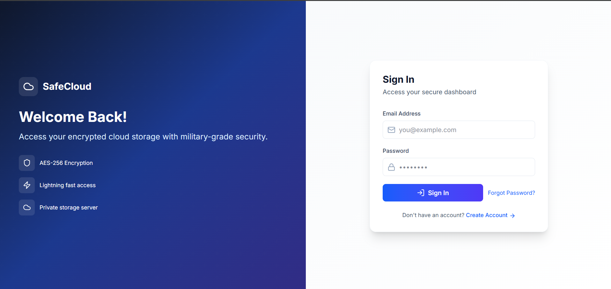
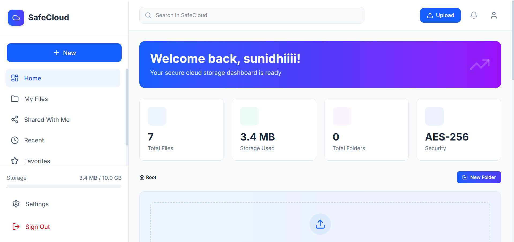
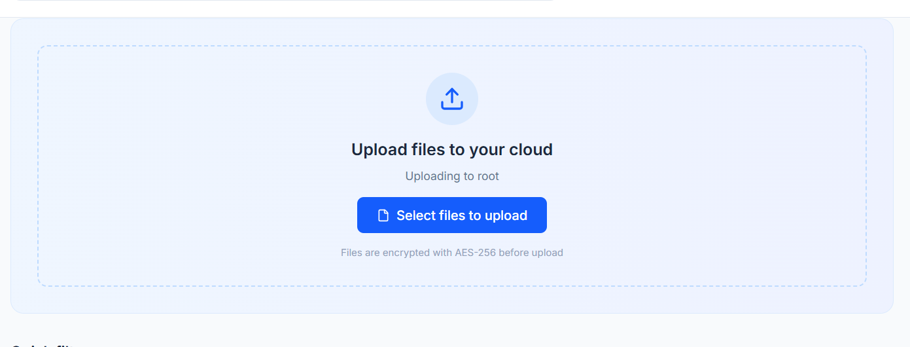
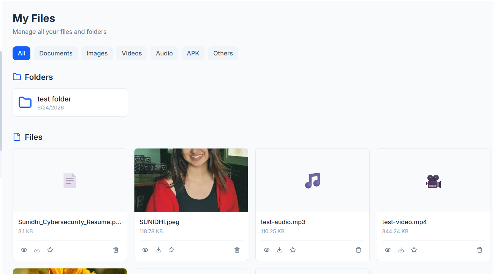
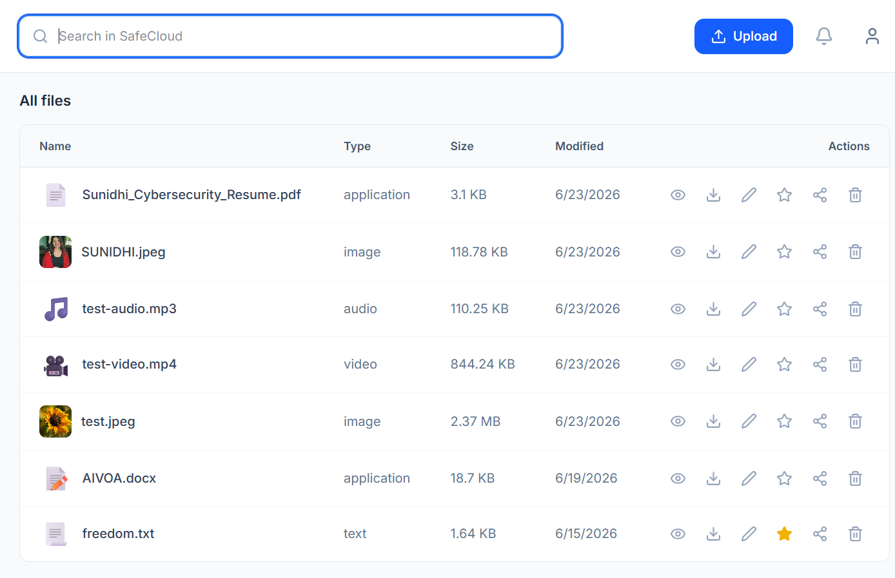

# SafeCloud - Secure Personal Cloud Storage System

## Overview

SafeCloud is a secure cloud storage platform developed as a final-year BCA project. The application allows users to securely store, organize, search, and manage files through a modern web interface while implementing security-focused design principles.

The project was built to demonstrate secure file management, user authentication, access control, and cloud storage concepts. Along with development, a dedicated security assessment was performed to evaluate the application against common web security vulnerabilities.

---

## Key Features

### Authentication & Authorization

* User Registration
* User Login
* Secure Session Management
* Protected Routes
* User-Specific Data Access

### File Management

* Upload Files
* Download Files
* Delete Files
* Organize Files into Folders
* File Search Functionality

### Folder Management

* Create Folders
* Navigate Folder Structure
* Organize User Data

### Security Features

* Authentication-Based Access Control
* User Isolation
* Secure File Handling
* Security Testing & Assessment
* OWASP-Inspired Security Review

---

## Technology Stack

### Frontend

* Next.js
* React
* TypeScript
* Tailwind CSS

### Backend

* Next.js API Routes
* Supabase

### Database

* PostgreSQL (Supabase)

### Deployment

* Vercel

### Security Testing

* Burp Suite
* Browser Developer Tools
* Manual Security Testing

---

## Project Architecture

```text
User
 │
 ▼
Next.js Frontend
 │
 ▼
Authentication Layer
 │
 ▼
Supabase Backend
 │
 ├── PostgreSQL Database
 └── File Storage
```

---

## Security Assessment

A dedicated security assessment was conducted against SafeCloud to evaluate:

* Authentication Security
* Authorization Controls
* File Upload Security
* Session Management
* Input Validation
* Broken Access Control
* OWASP Top 10 Risks

The complete assessment can be found in:

SafeCloud-Security-Assessment Repository

---

## Screenshots

### Login Page


### Dashboard


### File Upload


### Folder Management


### Search Functionality


## Project Highlights

* Developed a full-stack cloud storage application.
* Implemented authentication and user-based access control.
* Performed security testing and vulnerability assessment.
* Documented findings using a professional VAPT-style approach.
* Demonstrated both development and application security skills.

---

## Learning Outcomes

This project helped strengthen skills in:

* Web Application Development
* Secure Coding Practices
* Cloud Storage Concepts
* Database Design
* Authentication & Authorization
* Web Application Security Testing
* Vulnerability Assessment Methodology
* Security Documentation

---

## Future Enhancements

* Multi-Factor Authentication (MFA)
* File Sharing Between Users
* Advanced Search Capabilities
* Activity Monitoring
* Audit Logging
* End-to-End Encryption
* Role-Based Access Control (RBAC)

---

## Author

Sunidhi Adhikari

BCA Final Year Student

Cybersecurity Enthusiast | Web Application Security | QA Testing | Technical Support

GitHub: https://github.com/Sunidhiad


Check out our [Next.js deployment documentation](https://nextjs.org/docs/app/building-your-application/deploying) for more details.
